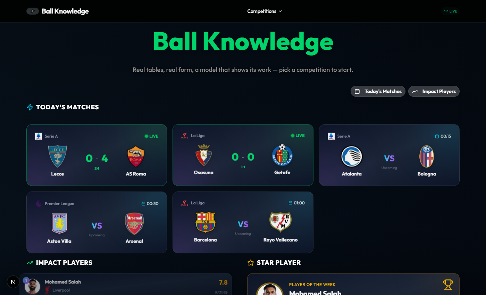
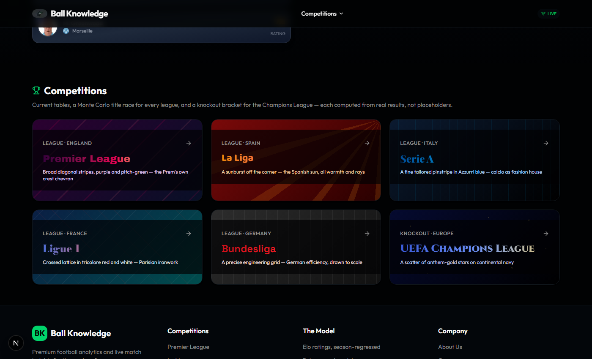
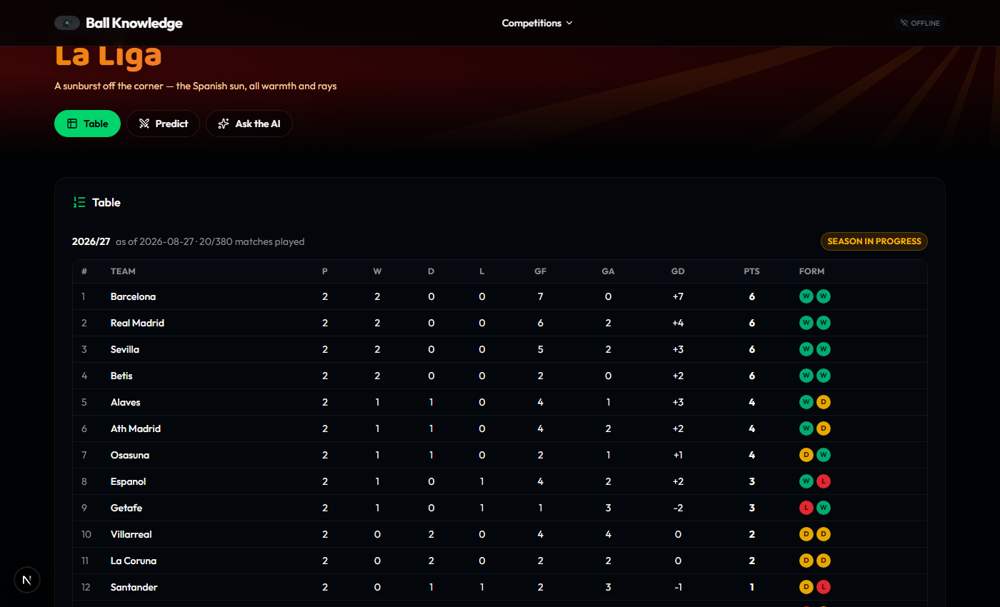
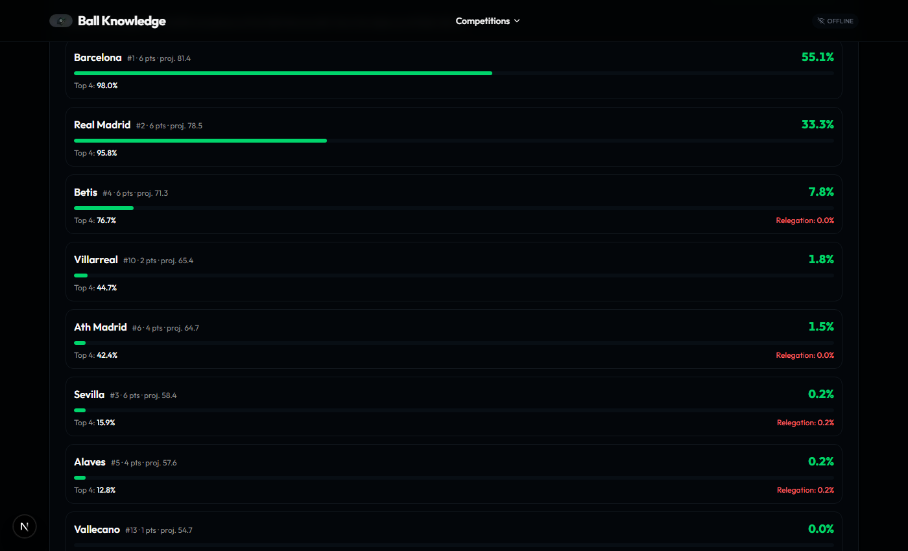
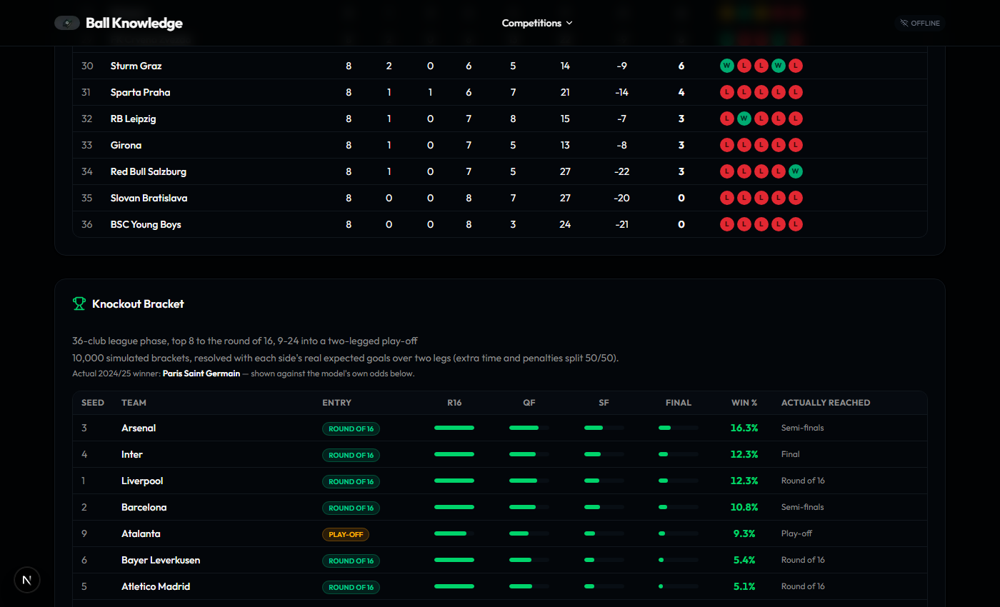
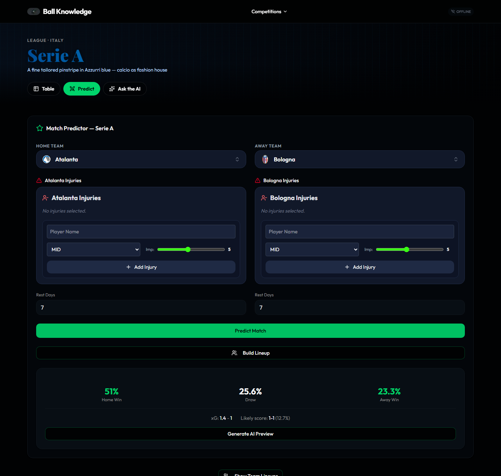
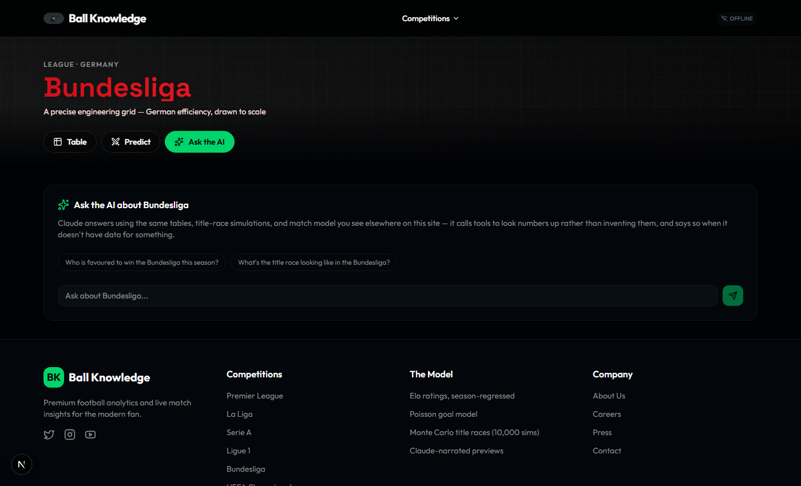
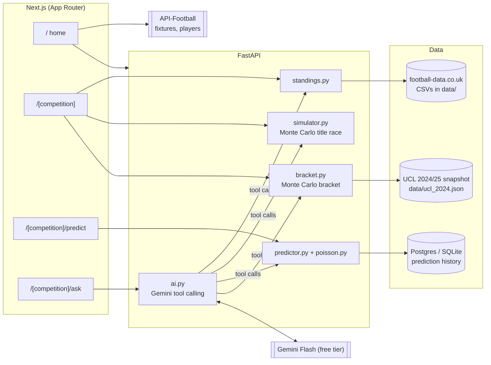

<div align="center">

# ⚽ Ball Knowledge

**Real tables. Real form. A prediction model that shows its work.**

Current standings, a Monte Carlo title race, a Champions League bracket simulation,
and per-match predictions — for the Premier League, La Liga, Serie A, Ligue 1,
Bundesliga, and the UEFA Champions League. Every number comes from real results,
never a placeholder, and Gemini narrates it on request without ever inventing a figure.

[](https://nextjs.org)
[](https://fastapi.tiangolo.com)
[](https://www.python.org)
[](https://www.typescriptlang.org)
[](https://ai.google.dev)
[](https://gsap.com)



</div>

## What it is

Ball Knowledge is a full end-to-end football analytics app: a FastAPI backend
that computes its own Elo ratings, goal expectations, and Monte Carlo
simulations from real match data, and a Next.js frontend that gives each
competition its own visual identity instead of one reskinned template six times.

- 📊 **Live standings** for all six competitions, computed from actual played
  results, always labelled with how much of the season has been played.
- 🎲 **A Monte Carlo title race** — 10,000 simulations of every remaining
  fixture, projecting title odds, top-4 odds, and relegation risk per team.
- 🏆 **A Champions League knockout bracket** simulated 10,000 times from a
  closed-form two-legged win probability, validated against what actually happened.
- 🔮 **Match predictions** with injury and rest-day adjustments, expected
  goals, and a likely scoreline — not just a home/draw/away split.
- 🤖 **AI-narrated previews and Q&A** (Gemini, free tier) that call read-only
  tools for every number they cite and say so plainly when the data isn't there.
- 🎨 **Six visual territories** — a real motif and typeface per competition,
  drawn from that league's own footballing culture.

## Six competitions, six identities

Each competition gets its own CSS-drawn motif and display typeface — Premier
League's diagonal crest chevrons in Archivo Black, La Liga's corner sunburst in
Baloo 2, Serie A's tailored pinstripe in Playfair Display, Ligue 1's ironwork
lattice in Bodoni Moda, Bundesliga's engineering grid in Space Grotesk, and the
Champions League's scattered anthem-gold stars in Cinzel. Everything else —
navigation, tables, body copy — stays on one shared design system.



## The model, not just the scoreboard

Every league gets a full table (with a relegation-line indicator and last-5
form), plus a title race that's an actual simulation, not a heuristic:





The Champions League gets its own club ratings — computed only from the 144
league-phase matches those 36 clubs actually played against each other, never
from domestic form, since a Bundesliga 1580 and a La Liga 1580 were never
compared. The bracket simulation is then checked against reality:



## A predictor that shows expected goals, not just a percentage

Home/draw/away comes from a blend of Elo and a power score; the scoreline
comes from a Poisson goal model calibrated to each league's own draw rate, so
the two can never quietly disagree with each other.



## An AI layer with a hard rule: it never invents a number

Ask a free-form question and Gemini answers by calling the same tools that
back every other page — `get_standings`, `get_title_race`, `predict_match`,
`get_bracket` — never by generating a figure on its own. If the data for a
question isn't available, it says so instead of guessing.



## Architecture



## How the model works

- **Elo ratings**, carried across seasons with regression to the mean at
  each boundary and a penalty for newly promoted clubs (`models/elo_engine.py`,
  `services/league_manager.py`).
- **A Poisson goal model**, calibrated per league against that league's own
  observed draw rate, shared by the match predictor and the `/predict` route
  so the two can never disagree (`models/poisson.py`).
- **Monte Carlo simulation** — 10,000 runs of the season's remaining
  fixtures for the title race, and 10,000 simulated knockout brackets for the
  Champions League, resolved with a closed-form two-legged win probability
  instead of an inner simulation loop (`services/simulator.py`,
  `services/bracket.py`).
- **Gemini** narrates the numbers above on request — it never computes or
  invents a figure itself, only relays ones already produced by the model,
  and says so plainly when it doesn't have the data (`services/ai.py`).

Standings for the five leagues come from football-data.co.uk CSVs checked
into `data/`, refreshed with `scripts/refresh_data.py`. The Champions League
is a one-time committed snapshot (`data/ucl_2024.json`) — the free
API-Football plan only serves 2022–2024, and the 2024/25 season is already
finished, so there's nothing to refresh.

## Tech stack

| | |
|---|---|
| **Backend** | FastAPI, SQLAlchemy + Alembic, pandas/NumPy, APScheduler |
| **Frontend** | Next.js 16 (App Router), React 19, Tailwind v4, GSAP + Lenis |
| **AI** | Gemini Flash via the Google Gen AI SDK (automatic function calling) — free tier |
| **Data** | football-data.co.uk (leagues), API-Football (fixtures/players/UCL snapshot) |
| **Database** | Postgres in production, SQLite for local dev |
| **Deployment** | Render (backend + Postgres), Vercel (frontend) |

## Project layout

```
services/        FastAPI app, data loading, standings/simulation/AI logic
models/          Elo engine, Poisson goal model, match predictor
scripts/         One-off data refresh and snapshot scripts
data/            Season CSVs + the UCL snapshot
alembic/         Database migrations
frontend_ui/     Next.js app (App Router)
```

Frontend routes:

| Route | Purpose |
|---|---|
| `/` | Competition picker + live fixtures/top-players widget |
| `/[competition]` | Table, and title race (leagues) or bracket (UCL) |
| `/[competition]/predict` | Match predictor, injuries, lineups, AI preview |
| `/[competition]/ask` | Free-form Q&A over the model via Gemini tool calling |

## API reference

All routes live in `services/api.py`.

| Method | Route | Description |
|---|---|---|
| `GET` | `/competitions` | Every competition the API knows about, and whether it loaded |
| `GET` | `/standings?league=` | Current table for a competition |
| `GET` | `/title_race?league=` | Monte Carlo title-race projection (leagues only) |
| `GET` | `/bracket?competition=` | Monte Carlo knockout bracket (cups only) |
| `GET` | `/teams?league=` | Teams with power scores for a competition |
| `POST` | `/predict` | Home/draw/away, expected goals, and a likely scoreline for one fixture |
| `POST` | `/ai/preview` | Streamed (SSE) AI narration of a prediction |
| `POST` | `/ai/title_race` | AI narration of a title-race projection |
| `POST` | `/ai/ask` | Free-form Q&A, the model calling tools for every figure it cites |
| `GET` | `/health` | Loaded leagues, football-API budget, AI-call budget |

## Local development

### Backend

```bash
pip install -r requirements.txt
cp .env.example .env   # fill in API_SPORTS_KEY and GEMINI_API_KEY
python -m alembic upgrade head
python -m uvicorn services.api:app --reload --port 8000
```

Without `DATABASE_URL` set, this uses a SQLite file at the repo root — no
Postgres needed for local dev.

### Frontend

```bash
cd frontend_ui
npm install
echo "NEXT_PUBLIC_API_URL=http://localhost:8000" > .env.local
npm run dev
```

> If port 8000 is already in use by something else on your machine, run the
> backend on a different port and update `NEXT_PUBLIC_API_URL` to match —
> `localhost` can resolve to a different service than you expect if
> something else is bound to the same port on a different IP stack (IPv4 vs
> IPv6). Prefer `127.0.0.1` over `localhost` if you hit this.

### Refreshing data

```bash
python scripts/refresh_data.py --check   # reports what's missing
python scripts/refresh_data.py           # downloads current + previous season
```

football-data.co.uk is sometimes blocked by network content filters (it
carries betting odds columns). If downloads fail, the script prints the
exact URLs so you can fetch them manually and drop the CSVs into
`data/<season>/`.

## Environment variables

See `.env.example` for the backend. In short:

| Variable | Required | Notes |
|---|---|---|
| `API_SPORTS_KEY` (or `API_FOOTBALL_KEY`) | Yes | Free plan: 100 requests/day, capped in-app at 90 |
| `GEMINI_API_KEY` | For `/ai/*` routes | Free tier — [aistudio.google.com/apikey](https://aistudio.google.com/apikey), no billing account needed. Everything else works without it |
| `DATABASE_URL` | No | Defaults to local SQLite; set for Postgres in production |

Frontend: `NEXT_PUBLIC_API_URL`, pointing at the backend's base URL.

## Deployment

Backend on **Render**, frontend on **Vercel**.

### Backend (Render)

This repo includes `render.yaml`, a blueprint that provisions a free
Postgres database and a web service wired together, running
`alembic upgrade head` on every deploy before starting the app.

1. Push this repo to GitHub (already done if you're reading this from there).
2. In the Render dashboard: **New → Blueprint**, point it at this repo.
   Render reads `render.yaml` and creates both resources.
3. Once created, open the web service's **Environment** tab and set:
   - `API_SPORTS_KEY` — your API-Football key
   - `GEMINI_API_KEY` — your Gemini API key (free, from aistudio.google.com/apikey)
   (`DATABASE_URL` is wired automatically from the Postgres instance.)
4. Deploy. Check `https://<your-service>.onrender.com/health` — it reports
   `leagues_loaded`, the API budget, and the AI budget.

### Frontend (Vercel)

1. **New Project** in Vercel, import this repo.
2. Set **Root Directory** to `frontend_ui` (this is a monorepo — the Next.js
   app isn't at the repo root).
3. Add an environment variable: `NEXT_PUBLIC_API_URL` = your Render service's
   URL (e.g. `https://ball-knowledge-api.onrender.com`).
4. Deploy.

### Post-deploy checklist

- [ ] `GET /health` on the backend shows all 6 competitions in `leagues_loaded`.
- [ ] `GET /standings?league=PL` returns a real table, not an empty one.
- [ ] A prediction from the deployed frontend succeeds and doesn't 500 (this is
      what the `predictions.match_id` migration exists to prevent on a fresh
      database — see `alembic/versions/166708d88600_predictions_match_id_nullable.py`).
- [ ] `NEXT_PUBLIC_API_URL` on Vercel points at the Render URL, not `localhost`.
- [ ] Render's free Postgres and free web service both spin down on
      inactivity; the first request after idling will be slow while they wake up.

## Known limitations

- The free API-Football plan only serves seasons 2022–2024, so live
  standings and title races are computed locally from CSVs rather than
  fetched — see the module docstring in `services/standings.py`.
- Data currency depends on `scripts/refresh_data.py` being run each
  matchday; nothing here auto-refreshes the CSVs.
- CORS is wide open (`allow_origins=["*"]`) since this is a public,
  read-mostly demo with no authentication. Lock it down in
  `services/api.py` if that ever changes.
- The AI layer runs on Gemini's **free tier**, which is rate limited rather
  than billed — under load the `/ai/*` routes may return a quota error while
  every other route keeps working. `services/ai.py` also caps itself at
  `DAILY_CALL_LIMIT` calls a day. Set `GEMINI_MODEL` to pin a different model
  without touching code.
